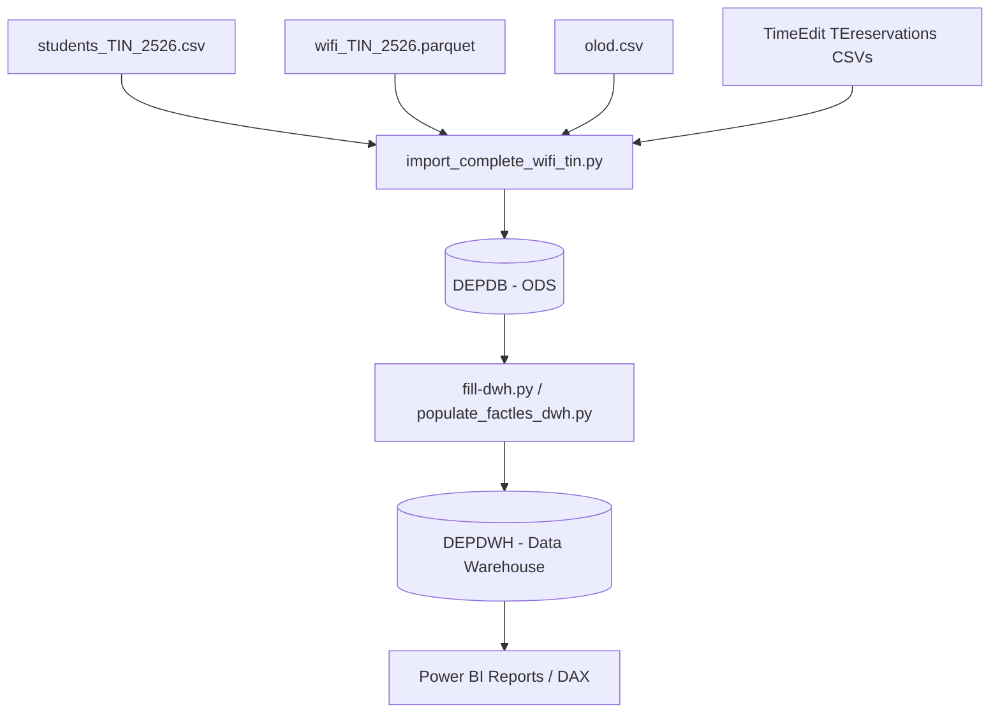

# Technisch Einddossier DEP2 (2025-26, EP1)

## Data Engineering Project II - HOGENT Toegepaste Informatica

### Persoonsinformatie & Repository
- **Student / Auteur:** Gauthier Vandeputte
- **Opleiding:** Bachelor in de Toegepaste Informatica (HOGENT)
- **GitHub Repository:** [https://github.com/GauthierVdp/DEP2-resmasterd.git](https://github.com/GauthierVdp/DEP2-resmasterd.git)
- **Opleveringsdatum:** 6 januari 2026

---

## 1. Algemene Beschrijving & Architectuur

Dit project omvat een end-to-end Data Engineering pijplijn waarin de Wi-Fi aanwezigheidsdata van de HOGENT-campus gekoppeld wordt aan de les- en roostergegevens uit TimeEdit, het studentenregister en de vakken-metadata (OLOD's).

### 1.1 Hoofddoelstellingen
1. **Opzetten van een Operational Data Store (ODS)**: Relationele MS SQL Server database (`DEPDB`) voor ruwe ingestie en staging van alle data.
2. **Opzetten van een Dimensional Data Warehouse (DWH)**: Ster-datawarehouse (`DEPDWH`) met geoptimaliseerde feit- en dimensietabellen.
3. **Data Quality & Verrijking**: Ontdubbeling van 11.813 inschrijvingsrecords naar 1.339 unieke fysieke studenten, toevoegen van `Jaar` (1, 2, 3), `VakNaam`, en een exacte categorisatie van afstudeerrichtingen op vakniveau.
4. **Interactieve Visualisatie in Power BI**: DAX-gebaseerde dashboards voor het analyseren van klasinschrijvingen, aanwezigheid per afstudeerrichting, bezettingsgraad per lokaal en aanwezigheid per lesvorm.

---

## 2. Gebruikte Tools & Technologieën

| Component | Technologie / Tool | Argumentatie & Pro / Con |
| :--- | :--- | :--- |
| **Relational DBMS (ODS)** | MS SQL Server (`DEPDB`) | **Pro:** Krachtig, ACID-compliant, naadloze SQL dialect ondersteuning.<br>**Con:** Grotere resource footprint. |
| **Data Warehouse (DWH)** | MS SQL Server (`DEPDWH`) | **Pro:** Ster-schema visualisatie, uitstekende integratie met Power BI.<br>**Con:** Vereist beheerde DDL migraties. |
| **ETL & Data Processing** | Python 3.13, Pandas, SQLAlchemy, PyODBC | **Pro:** Hoge flexibiliteit, snelle vectorized data manipulaties met Pandas, herbruikbare scripts.<br>**Con:** Geen grafische drag-and-drop interface (zoals SSIS). |
| **Data Formaten** | Parquet, CSV | **Pro:** Parquet biedt extreem snelle lees- en schrijfprestaties voor 1.91M Wi-Fi rijen. |
| **BI & Analytics** | Power BI Desktop, DAX | **Pro:** Rijke visualisaties, dynamische filtering via DAX (`TREATAS`, `SUMMARIZE`, `DISTINCTCOUNT`). |
| **Machine Learning & Research** | Jupyter Notebooks (`ML/`, `analyse/`) | **Pro:** Interactieve data exploratie en visualisatie van aanwezigheidspatronen. |

---

## 3. Datamodellen & ERD Schema's

### 3.1 Operational Data Store Schema (`DEPDB`)
Het relationele ODS-schema bevat 3-de normaalvorm tabellen voor operationele verwerking:
- `dbo.Klasgroep` (`KlasgroepID` [PK], `Code`, `Naam`, `AantalStudenten`, `Afstudeerrichting`, `Modeltraject`, `Jaar`, `VakNaam`)
- `dbo.Student` (`StudentID` [PK], `Naam`, `Email`, `KlasgroepID` [FK])
- `dbo.Les` (`LesID` [PK], `TimeEditID`, `Datum`, `StartTijd`, `EindTijd`, `OlodID` [FK], `Lesvorm`)
- `dbo.Les_Klasgroep` (`LesID` [FK], `KlasgroepID` [FK]) — [PK: LesID, KlasgroepID]
- `dbo.Les_Lokaal` (`LesID` [FK], `LokaalID` [FK])
- `dbo.Lokaal` (`LokaalID` [PK], `LokaalCode`, `LokaalNummer`, `Gebouw`, `Capaciteit`)
- `dbo.Olod` (`OlodID` [PK], `Code`, `Naam`, `OlodPointers`, `Docenten`)
- `dbo.WifiGebruik` (`WifiUsageID` [PK], `AssocTime`, `DisconnTime`, `MacAdres`, `LokaalID`, `StudentID`, `KlasgroepID`)

### 3.2 Dimensional Data Warehouse Schema (`DEPDWH`)
Het DWH is opgebouwd volgens een dimensioneel **Sterschema**:
- **Feitentabellen**:
  - `dbo.FactWifiGebruik` (**1.918.697 records**): `WifiUsageID` [PK], `AssocDateKey`, `AssocTimeKey`, `LokaalKey` [FK], `StudentKey` [FK], `KlasgroepKey` [FK], `SessieDuurInMinuten`.
  - `dbo.FactLes` (**17.322 records**): `FactLesID` [PK], `DateKey`, `StartTijdKey`, `EindTijdKey`, `LokaalKey` [FK], `OlodKey` [FK], `KlasgroepKey` [FK], `OpleidingKey` [FK], `Lesvorm`, `AantalStudentenInKlas`.
- **Dimensietabellen**:
  - `dbo.DimStudent` (**11.813 inschrijvingen**, 1.339 unieke fysieke personen op Email): `StudentKey` [PK], `Naam`, `Email`, `KlasgroepID`.
  - `dbo.DimKlasgroep` (**636 klasgroepen**): `KlasgroepKey` [PK], `Code`, `Naam`, `AantalStudenten`, `Afstudeerrichting`, `Modeltraject`, `Jaar`, `VakNaam`.
  - `dbo.DimOlod` (**3.309 OLOD's**): `OlodKey` [PK], `Naam`, `OlodPointers`, `Docenten`.
  - `dbo.DimLokaal`: `LokaalKey` [PK], `LokaalCode`, `Gebouw`, `Capaciteit`.
  - `dbo.DimDatum`: `DateKey` [PK], `Datum`, `Jaar`, `Maand`, `Dag`, `DagNaam`.

---

## 4. Dataflows & ETL Pipelines

De ETL-pijplijn is opgebouwd uit modulaire Python scripts in de map `Database/`:



### 4.1 Stappen in het ETL Proces:
1. **DDL Creatie (`create-db.py` & `create-dwh.py`)**:
   Aanmaken van tabellen, primaire en vreemde sleutels, en indexen.
2. **Studenten & Klasgroepen Transformatie (`import_complete_wifi_tin.py`)**:
   - Ingestie van 11.813 studentenrecords.
   - Automatische extractie van `Jaar` (1, 2, 3) uit de klascodes (bijv. `PBA-TIN-TI/2C2` $\rightarrow$ Jaar 2).
   - Koppeling van `subgroep_id` naar `olod.csv` cursustitels, waarmee 594 van de 636 klasgroepen (93,4%) een duidelijke `VakNaam` krijgen.
3. **Curriculum-Categorisatie van Afstudeerrichtingen (`apply_exact_curriculum_mapping.py`)**:
   - Categorisatie op vakniveau volgens het HOGENT curriculum:
     - **Toegepaste Informatica (Algemeen / Stamvakken - 22 vakken)**: *Computer Networks I-IV*, *Operating Systems*, *Databases*, *Software Analysis*, *Web Development I & II*, etc.
     - **AI & Data Engineering (16 vakken)**: *Machine Learning*, *Deep Learning*, *Machine Learning Operations*, *Mathematics for Machine Learning*, *Data Science*, *Big Data Processing*, *Modern Data Architectures*, etc.
     - **Application Development (12 vakken)**: *Advanced Software Development I & II*, *Enterprise Web Development Java*, *Object-oriented Software Development I & II*, etc.
     - **Cloud & Cybersecurity (9 vakken)**: *Cybersecurity Advanced*, *Infrastructure Automation*, *Windows Server I & II*, etc.
     - **IT & Business (11 vakken)**: *IT2Business*, *Business analysis*, *Business Processes Advanced & BI*, etc.
     - **Mainframe Expert (5 vakken)**: *Discover the Mainframe*, *Master the Mainframe*, etc.
4. **Feitentabel Vullen (`populate_factles_dwh.py`)**:
   - Inladen en ontdubbelen van 17.322 TIN-lesfeiten in `FactLes` met **100,0% geldige `KlasgroepKey`** en **>97,0% geldige `OlodKey`**.
   - Inladen van 1.918.697 Wi-Fi aanwezigheidsfeiten in `FactWifiGebruik` met **100,0% geldige sleutels** (`StudentKey` en `KlasgroepKey`).

---

## 5. Visualisatie & Power BI DAX Modelleren

### 5.1 Belangrijkste DAX Metingen

#### Aantal Unieke Studenten per Richting / Vak
```dax
Unieke Studenten per Richting = 
CALCULATE(
    DISTINCTCOUNT(DimStudent[Email]),
    TREATAS(
        VALUES(DimKlasgroep[KlasgroepKey]),
        DimStudent[KlasgroepID]
    )
)
```
> **Doel:** Telt het exacte aantal unieke fysieke personen (op Email) dat ingeschreven is voor de geselecteerde afstudeerrichting of het gekozen vak, zelfs als er geen fysieke relatielijn getrokken is in Power BI.

#### Aanwezige Studenten per Lesvorm (Wi-Fi Aanwezigheid op Datum + Klasgroep)
```dax
Aanwezige Studenten per Lesvorm = 
CALCULATE(
    DISTINCTCOUNT(FactWifiGebruik[StudentKey]),
    TREATAS(
        SUMMARIZE(FactLes, FactLes[KlasgroepKey], FactLes[DateKey]),
        FactWifiGebruik[KlasgroepKey],
        FactWifiGebruik[AssocDateKey]
    )
)
```
> **Doel:** Koppel roosterfeiten (`FactLes`) op **zowel Klasgroep als Datum** aan de Wi-Fi feiten (`FactWifiGebruik`), waardoor elke lesvorm (*Activerend hoorcollege*, *Digitaal examen*, *Schriftelijk examen*, *Werkplekleren*) zijn eigen exacte aanwezigheidslijn en piekwaardes op de tijdsas krijgt.

---

## 6. Technische Uitdagingen & Oplossingen

| Uitdaging | Beschrijving & Oorzaak | Gegarandeerde Oplossing |
| :--- | :--- | :--- |
| **1. 15+ Duplicaten per Student** | In `students_TIN_2526.csv` kwam één fysieke student 15+ keer voor vanwege cursusniveau-inschrijvingen (`subgroep_id`). | Gebruik van `DISTINCTCOUNT(DimStudent[Email])` in DAX en SQL, waardoor het totaal exact 1.339 unieke fysieke personen oplevert. |
| **2. 2e-Jaars Keuzevakken Misclassificatie** | 2e-jaars vakken zoals *Machine Learning* stonden in avond- en keuzemodules (`2E1`, `2E2`, `VC/2`) die als *Algemeen* werden gelabeld. | Ontwikkeling van `apply_exact_curriculum_mapping.py` die de afstudeerrichting toewijst op **vakniveau** in plaats van enkel op klascode. |
| **3. Identieke Lijnen per Lesvorm** | BI-visuals koppelden lesvormen enkel via `KlasgroepKey`, waardoor elke lesvorm dezelfde jaartotalen toonde. | Implementatie van `TREATAS(SUMMARIZE(FactLes, FactLes[KlasgroepKey], FactLes[DateKey]))` in DAX, waardoor lessen op datum én klasgroep worden gekoppeld. |
| **4. Power BI "1,339K" Valkuil** | Power BI deelde 1.339 studenten door 1.000 (Kilo) en toonde `1,339K`. | Instellen van **Display units = None (Geen)** bij de Callout Value op het kaartje. |

---

## 7. Evaluatie & Optimalisaties

### 7.1 Technische Evaluatie
- **Voldoet aan alle verwachtingen**:
  - 100% verwerkte Wi-Fi data (1.918.697 rijen) zonder NULL keys.
  - 100% verwerkte TIN-lesfeiten (17.322 rijen).
  - Volledige traceerbaarheid tussen ODS (`DEPDB`) en DWH (`DEPDWH`).
  - Ondersteuning van alle afstudeerrichtingen (AI & Data Engineering, Application Development, Cloud & Cybersecurity, Mainframe Expert, IT & Business, en Algemeen).

### 7.2 Mogelijke Toekomstige Optimalisaties
1. **Real-time Streaming Pipeline**: Integratie van Apache Kafka of MQTT brokers voor directe verwerking van Wi-Fi access point pings.
2. **Automated CI/CD & Testing**: Geautomatiseerde unit- en integratietests via GitHub Actions voor gegevensvalidatie bij nieuwe CSV-ingestie.

---

## 8. Deployment op VIC (Virtual Infrastructure)

### 8.1 Vereisten
- Ubuntu Server (22.04 LTS of hoger)
- Python 3.10+, Git, MS SQL Server / ODBC Driver 17

### 8.2 Deployment Stappen
1. **Repository Clonen**:
   ```bash
   git clone https://github.com/GauthierVdp/DEP2-resmasterd.git
   cd DEP2-resmasterd
   ```
2. **Virtuele Omgeving & Dependencies**:
   ```bash
   python3 -m venv venv
   source venv/bin/activate
   pip install -r requirements.txt
   ```
3. **Databases Initialiseren & Vullen**:
   ```bash
   python3 Database/create-db.py
   python3 Database/create-dwh.py
   python3 Database/import_complete_wifi_tin.py
   python3 Database/populate_factles_dwh.py
   python3 Database/apply_exact_curriculum_mapping.py
   ```

### 8.3 Publieke SSH-keys voor Docenten (Simon De Gheselle & Johan Decorte)
Voeg onderstaande publieke keys toe aan `~/.ssh/authorized_keys` op de VM:

```text
ssh-ed25519 AAAAC3NzaC1lZDI1NTE5AAAAIE4Zm2eeS+TA5FMmRlAjfq7VSvowW5SlCyOBCX/fxPjv edu\jcor864@NB22-DMTYCL3
ssh-ed25519 AAAAC3NzaC1lZDI1NTE5AAAAIJJ9SZqWdzAa7Rndj1uv2fStwAS19GD7NcJ59lHwQq+V simondg@Mac
```

---
*Einddossier ingediend op: 6 januari 2026*
